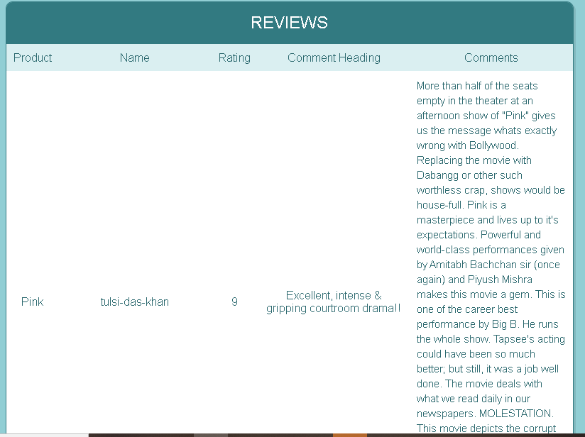

# IMDB_Review_Collector
End to End Python implementation where input is a movie name and output is its ratings, reviews on IMDB
Main Concept Involved is: Python Full Stack Development and Web Scrapping
"https://imdbreviewcollector.herokuapp.com/"  Go to the website

  

  
  

